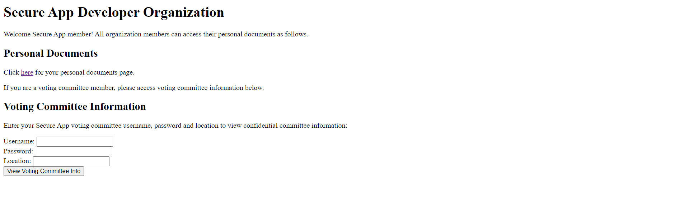

This semester, I took a course on cybersecurity. It's a  theoretical unit and there's not much to say about it. If anyone is interested in taking cybersecurity, know that there is a lot of maths involved in this subject, particularly on the topic of number theory. This is because you're using some property of maths to create a "lock" to say the least.

There's not much practical work done on this unit. Some of the more practical work involved in the tutorials of this unit revolves around learning to use one of the more complicated tools which is openSSL and gpg. It's not difficult to understand. It's just tedious to use.

Taken from <a href="https://smallstep.com/blog/if-openssl-were-a-gui/">https://smallstep.com/blog/if-openssl-were-a-gui/</a>

There was also a portion of the unit revolving around trying to find a vulnerability of a website. It was a simple website with simple html and php code, nothing fancy. But I do learn a bit about stopping very noobish, amateurish, simple and obvious attacks. Nothing to brag about here as well.

We learn a bit about simple security concepts like the different types of cyphers used and whatnot. I think the real meat here is the various simple ways the mathematical properties of these cyphers can be used to crack them and I think this is a facinating topic.